# MCP Daily Planning System

**Intelligent email and calendar analysis with AI-powered task generation**

[]()
[]()
[]()

---

## Executive Summary

The MCP Daily Planning System is an automated workflow that analyzes your emails and calendar to create actionable daily plans. It uses AI to understand email context, extract specific actions, and prioritize your day.

**Key Benefits:**
- 📧 Analyzes 2 weeks of email threads for full context
- 🤖 AI-powered extraction of specific, actionable items
- 📅 Integrates calendar events with smart prioritization
- ✅ Creates individual Todoist tasks (no more combined mega-tasks)
- 🎯 Filters out spam and vague "consider best practices" noise
- 🔄 Automatic cleanup of old tasks

**Quick Start:**
```bash
python run_process_new_v2.py
```

---

## Table of Contents

1. [Business Design](#business-design)
2. [Feature Overview](#feature-overview)
3. [Feature Catalog](#feature-catalog)
4. [System Applicability](#system-applicability)
5. [User Experience Design](#user-experience-design)
6. [Technical Design](#technical-design)
7. [Implementation Plan](#implementation-plan)
8. [Appendix](#appendix)

---

## Business Design

### Problem Statement

Modern professionals face information overload:
- **100+ emails per day** across multiple threads
- **Calendar conflicts** and forgotten appointments
- **Context switching** between email, calendar, and task manager
- **Generic task lists** that don't capture email context
- **Spam tasks** like "consider best practices" that waste time

### Solution

An intelligent automation system that:
1. **Analyzes email threads** over 2 weeks to understand full context
2. **Extracts specific actions** using AI (no vague tasks)
3. **Integrates calendar events** with smart filtering
4. **Creates individual tasks** in Todoist with full context
5. **Cleans up automatically** to prevent task accumulation

### Value Proposition

| Traditional Approach | MCP Daily Planning |
|---------------------|-------------------|
| Read 100+ emails manually | AI analyzes 15 priority threads |
| Create vague tasks | Specific, actionable items only |
| Forget calendar conflicts | Important events auto-added |
| Context lost in task manager | Full email context in description |
| Tasks accumulate | Auto-cleanup with labels |
| 30+ minutes daily | 30 seconds to review |

### Target Users

- **Busy professionals** managing 50+ emails/day
- **Project managers** tracking multiple threads
- **Executives** needing daily briefings
- **Anyone** using Gmail + Todoist + Google Calendar

---

## Feature Overview

### Core Features

1. **Email Thread Analysis**
   - Groups emails by subject over 2 weeks
   - Prioritizes threads by recency, sender, and importance
   - AI analyzes full thread context
   - Extracts specific action items only

2. **Calendar Integration**
   - Fetches events for next 7 days
   - Filters important events (cancellations, appointments)
   - Skips routine recurring events
   - Creates tasks with date/time

3. **AI-Powered Analysis**
   - Uses OpenRouter (GPT-4o-mini) for understanding
   - Extracts: summary, outcome, actions, priority, context
   - Filters out vague/spam actions
   - Provides "why it matters" context

4. **Task Management**
   - Individual tasks per action (not combined)
   - High priority (red) for urgent items
   - Medium priority (orange) for important items
   - Auto-cleanup with `daily-plan` label

5. **DakBoard Display**
   - Clean, scannable task titles
   - No clutter or generic text
   - Full context in task description
   - Calendar events clearly marked

---

## Feature Catalog

### Email Analysis Features

| Feature | Description | Status |
|---------|-------------|--------|
| 2-Week Lookback | Analyzes emails from last 14 days | ✅ Production |
| Thread Grouping | Groups emails by subject (removes RE:/FW:) | ✅ Production |
| Priority Scoring | Ranks threads by recency, sender, count | ✅ Production |
| Top 15 Analysis | Analyzes only top 15 threads (cost optimization) | ✅ Production |
| AI Context Extraction | Understands full thread conversation | ✅ Production |
| Action Item Extraction | Pulls specific, concrete actions only | ✅ Production |
| Spam Filtering | Rejects vague "consider/review" tasks | ✅ Production |
| Follow-up Detection | Identifies threads needing response | ✅ Production |

### Calendar Features

| Feature | Description | Status |
|---------|-------------|--------|
| 7-Day Lookahead | Fetches events for next week | ✅ Production |
| Event Filtering | Includes cancellations, appointments, social | ✅ Production |
| Recurring Skip | Skips routine events (e.g., regular Taekwondo) | ✅ Production |
| Cancellation Alert | High priority for cancelled events | ✅ Production |
| Time Display | Shows event time in task title | ✅ Production |

### Task Creation Features

| Feature | Description | Status |
|---------|-------------|--------|
| Individual Tasks | One task per action (not combined) | ✅ Production |
| Auto-Cleanup | Deletes old `daily-plan` tasks | ✅ Production |
| Priority Levels | High (red), Medium (orange) | ✅ Production |
| Rich Descriptions | Includes who, what, why, context | ✅ Production |
| Label Tagging | `daily-plan` and `calendar` labels | ✅ Production |
| Due Dates | Sets appropriate due dates | ✅ Production |

### Optional Features

| Feature | Description | Status |
|---------|-------------|--------|
| Amplenote Integration | Creates daily plan note | ✅ Optional |
| JSON Export | Saves full analysis to file | ✅ Production |
| Console Logging | Detailed execution trace | ✅ Production |

---

## System Applicability

### Supported Platforms

- **Operating Systems:** Windows, macOS, Linux
- **Python:** 3.8+
- **Email:** Gmail (via Gmail API)
- **Calendar:** Google Calendar (via Calendar API)
- **Tasks:** Todoist (via Todoist API v1)
- **Notes:** Amplenote (via Amplenote API v4) - Optional
- **AI:** OpenRouter (GPT-4o-mini)

### Integration Requirements

| Service | Requirement | Purpose |
|---------|------------|---------|
| Gmail API | OAuth 2.0 credentials | Email fetching |
| Google Calendar API | OAuth 2.0 credentials | Event fetching |
| Todoist API | API token | Task creation |
| OpenRouter API | API key | AI analysis |
| Amplenote API | OAuth token | Note creation (optional) |

### Deployment Options

1. **Local Execution** - Run manually when needed
2. **Scheduled Task** - Windows Task Scheduler / cron
3. **Always-On Server** - Run on home server / VPS
4. **Cloud Function** - AWS Lambda / Google Cloud Functions (future)

---

## User Experience Design

### User Personas

#### Persona 1: The Busy Executive
- **Name:** Sarah, VP of Operations
- **Email Volume:** 150+ emails/day
- **Pain Points:** Misses important emails, forgets follow-ups
- **Goals:** Stay on top of priorities without reading every email
- **Usage:** Runs daily at 6 AM, reviews tasks over coffee

#### Persona 2: The Project Manager
- **Name:** Mike, Senior PM
- **Email Volume:** 80+ emails/day across 10 projects
- **Pain Points:** Context switching, lost email threads
- **Goals:** Track action items across multiple projects
- **Usage:** Runs after lunch, syncs with team standup

#### Persona 3: The Consultant
- **Name:** Alex, Independent Consultant
- **Email Volume:** 50+ emails/day from multiple clients
- **Pain Points:** Calendar conflicts, missed appointments
- **Goals:** Never miss a client meeting or deadline
- **Usage:** Runs morning and evening, checks before meetings

---

### User Journeys

#### Journey 1: Morning Planning Routine

```
1. Wake up (6:00 AM)
   ↓
2. Run: python run_process_new_v2.py
   ↓
3. System analyzes:
   - 127 emails from last 2 weeks
   - 42 email threads
   - 6 calendar events
   ↓
4. AI extracts:
   - 3 high priority actions
   - 2 medium priority actions
   - 4 calendar events
   ↓
5. Creates 9 Todoist tasks
   ↓
6. User opens DakBoard (6:05 AM)
   ↓
7. Sees clean list:
   - Reply to Sarah about phonics
   - Brunch with KO at 12 PM
   - TKD cancelled Wednesday
   - Dr Howard Friday 5 PM
   ↓
8. User knows exactly what to do
   ↓
9. Starts day with clarity (6:10 AM)
```

**Time Saved:** 25 minutes (vs. reading 127 emails)

#### Journey 2: Handling Email Overload

```
1. Return from vacation (100+ unread emails)
   ↓
2. Run: python run_process_new_v2.py
   ↓
3. System groups into 35 threads
   ↓
4. Analyzes top 15 priority threads
   ↓
5. Extracts 8 action items
   ↓
6. User focuses on 8 tasks (not 100 emails)
   ↓
7. Completes high priority items
   ↓
8. Archives remaining emails
```

**Time Saved:** 2+ hours

#### Journey 3: Calendar Conflict Prevention

```
1. System runs daily at 6 AM
   ↓
2. Detects: "Cancelled TKD March 4 Wednesday"
   ↓
3. Creates high priority task (red)
   ↓
4. User sees on DakBoard
   ↓
5. Doesn't drive to cancelled class
   ↓
6. Saves 1 hour + gas
```

**Value:** Prevents wasted time

---

### Wireframes

#### DakBoard Display (Before)

```
┌─────────────────────────────────────────────────────────┐
│ Todoist - Today                                          │
├─────────────────────────────────────────────────────────┤
│ 📋 Daily Plan - Feb 28 | ⚠️ ACTION NEEDED: | • Review   │
│ the attached agenda for the week. - "Prescott, Lisa K"  │
│ | • Consider responding to Sarah with your preference   │
│ regarding the shift towards phonics/spelling. -         │
│ "Williams, Sarah H 1" | • Investigate potential         │
│ compliance strategies that balance age-verification     │
│ with data protection. - CodeProject Trending Technology │
│ | 📧 FOLLOW UP: 3 threads need response                 │
└─────────────────────────────────────────────────────────┘
```
**Problems:** Cluttered, hard to read, vague actions

#### DakBoard Display (After)

```
┌─────────────────────────────────────────────────────────┐
│ Todoist - Today                                          │
├─────────────────────────────────────────────────────────┤
│ 🔴 Reply to Sarah about phonics/spelling focus          │
│ 🟠 Review attached agenda for important dates           │
│ 🟠 Purchase tickets for "Scream 7" if interested        │
│ 🟠 Brunch with KO at 12:00 PM                           │
│ 🔴 Cancelled TKD March 4 Wednesday at 06:30 PM          │
│ 🔴 Couch Pickup at 06:00 AM (Friday)                    │
│ 🔴 Dr Howard at 05:00 PM (Friday)                       │
└─────────────────────────────────────────────────────────┘
```
**Benefits:** Clean, scannable, specific actions

---

### Interaction Flows

#### Flow 1: Task Creation


#### Flow 2: Calendar Event Processing


---

## Technical Design

### Data Model

#### Email Thread Object
```python
{
    "subject": str,           # Thread subject (cleaned)
    "emails": [               # List of emails in thread
        {
            "id": str,
            "from": str,
            "date": str,
            "body": str,
            "preview": str
        }
    ],
    "priority_score": float,  # Calculated priority
    "latest_date": str        # Most recent email date
}
```

#### Analysis Object
```python
{
    "summary": str,           # What happened
    "outcome": str,           # What's resolved
    "action_items": [str],    # Specific actions
    "follow_up_needed": bool, # Needs response?
    "follow_up_reason": str,  # Why/when/who
    "priority": str,          # high/medium/low
    "priority_reason": str,   # Why this priority
    "context": str,           # Why it matters
    "thread_subject": str,    # Original subject
    "email_count": int,       # Emails in thread
    "latest_sender": str,     # Who sent last
    "latest_date": str        # When sent
}
```

#### Task Object
```python
{
    "content": str,           # Task title
    "description": str,       # Full context
    "priority": int,          # 1-4 (4=high)
    "due_string": str,        # "today", "2026-03-01"
    "labels": [str]           # ["daily-plan", "calendar"]
}
```

---

### Architecture

See [docs/architecture.md](docs/architecture.md) for detailed class diagram and process flow.

**High-Level Architecture:**

```
┌─────────────────────────────────────────────────────────┐
│                   User Interface                         │
│              (DakBoard / Todoist App)                    │
└─────────────────────────────────────────────────────────┘
                         ↑
                         │ Tasks
                         │
┌─────────────────────────────────────────────────────────┐
│              run_process_new_v2.py                       │
│              (Main Orchestrator)                         │
└─────────────────────────────────────────────────────────┘
         ↓              ↓              ↓              ↓
┌──────────────┐ ┌──────────────┐ ┌──────────────┐ ┌──────────────┐
│ GmailTools   │ │CalendarTools │ │TodoistTools  │ │AmplenoteTools│
└──────────────┘ └──────────────┘ └──────────────┘ └──────────────┘
         ↓              ↓              ↓              ↓
┌─────────────────────────────────────────────────────────┐
│                   AuthManager                            │
│         (Centralized Credential Management)              │
└─────────────────────────────────────────────────────────┘
                         ↓
┌─────────────────────────────────────────────────────────┐
│              environments.json                           │
│         (External Configuration File)                    │
└─────────────────────────────────────────────────────────┘
```

---

### Complete Skill Dependencies

This system integrates with multiple skills and external guides for comprehensive functionality.

#### Skill Dependency Diagram


#### Core Component Dependencies

| Component | Dependencies | Purpose | Status |
|-----------|-------------|---------|--------|
| **run_process_new_v2.py** | auth_manager, gmail_tools, calendar_tools, todoist_tools, comprehensive_analyzer | Main orchestrator | ✅ Production |
| **auth_manager.py** | environments.json | Credential management | ✅ Production |
| **gmail_tools.py** | Gmail API, auth_manager | Email fetching | ✅ Production |
| **gmail_thread_tools.py** | gmail_tools | Thread grouping | ✅ Production |
| **calendar_tools.py** | Google Calendar API, auth_manager | Event fetching | ✅ Production |
| **todoist_tools.py** | Todoist API, auth_manager | Task creation | ✅ Production |
| **amplenote_tools.py** | Amplenote API, auth_manager, OpenRouter | Note creation | ✅ Optional |
| **comprehensive_analyzer.py** | OpenRouter API, auth_manager | AI analysis | ✅ Production |
| **scheduler.py** | schedule, filelock, run_process_new_v2 | Automated execution | ✅ Production |

#### External Skill Dependencies

| Skill | Location | Purpose | Integration |
|-------|----------|---------|-------------|
| **Media Filing** | `G:\My Drive\04_Resources\Media\HOW_TO_FILE_MEDIA.md` | Media organization rules | Referenced for file organization |
| **File Organization** | `G:\My Drive\06_Skills\automation\skill_file_organization.md` | Complete PARA filing system | Download processing workflow |
| **Tool Filing** | `G:\My Drive\06_Skills\_tools\HOW_TO_FILE_TOOLS.md` | Skills folder organization | Tool categorization |
| **Diagram Tools** | `G:\My Drive\06_Skills\documentation\diagram-tools\` | Mermaid to Visio conversion | Documentation generation |

#### Python Package Dependencies

| Package | Version | Purpose | Required |
|---------|---------|---------|----------|
| google-auth | Latest | Gmail/Calendar OAuth | ✅ Yes |
| google-auth-oauthlib | Latest | OAuth flow | ✅ Yes |
| google-auth-httplib2 | Latest | HTTP transport | ✅ Yes |
| google-api-python-client | Latest | Gmail/Calendar APIs | ✅ Yes |
| requests | Latest | HTTP requests | ✅ Yes |
| schedule | Latest | Task scheduling | ✅ Yes (for scheduler) |
| filelock | Latest | Concurrent run prevention | ✅ Yes (for scheduler) |
| pathlib | Built-in | Path handling | ✅ Yes |
| asyncio | Built-in | Async operations | ✅ Yes |
| argparse | Built-in | CLI arguments | ✅ Yes |

#### API Service Dependencies

| Service | Type | Authentication | Rate Limits | Cost |
|---------|------|----------------|-------------|------|
| **Gmail API** | OAuth 2.0 | `gmail_credentials.json` | 250 quota units/user/sec | Free |
| **Google Calendar API** | OAuth 2.0 | `calendar_credentials.json` | 1M requests/day | Free |
| **Todoist API** | Bearer Token | API token in environments.json | No published limit | Free tier available |
| **OpenRouter API** | API Key | API key in environments.json | Varies by plan | Pay per use |
| **Amplenote API** | OAuth 2.0 | OAuth token in environments.json | No published limit | Free tier available |

#### Configuration Dependencies

| File | Location | Purpose | Required |
|------|----------|---------|----------|
| **environments.json** | `G:\My Drive\03_Areas\Keys\Environments\` | All API credentials | ✅ Yes |
| **gmail_credentials.json** | Same as environments.json | Gmail OAuth | ✅ Yes |
| **calendar_credentials.json** | Same as environments.json | Calendar OAuth | ✅ Yes |
| **token.pickle** | Generated at runtime | Cached OAuth tokens | Auto-generated |

#### Scheduler Dependencies

| Component | Type | Purpose | Platform |
|-----------|------|---------|----------|
| **scheduler.py** | Python script | Continuous scheduling | Cross-platform |
| **Windows Task Scheduler** | OS service | Watchdog for scheduler.py | Windows only |
| **Cron** | OS service | Alternative scheduler | Linux/Mac |
| **Systemd** | OS service | Service management | Linux |

#### Output Dependencies

| Output | Location | Format | Purpose |
|--------|----------|--------|---------|
| **Todoist Tasks** | Todoist app/API | Tasks with labels | Primary output |
| **JSON Analysis** | `output/comprehensive_analysis_*.json` | JSON | Detailed analysis log |
| **Amplenote Note** | Amplenote app/API | Markdown note | Optional summary |
| **Console Log** | stdout | Text | Execution trace |
| **Scheduler Log** | `logs/scheduler_*.log` | Text | Scheduler activity |

---

### Scripts and Tools Reference

Complete catalog of all scripts and tools in the MCP Daily Planning System.

#### Tool Organization Diagram

```mermaid
graph TB
    subgraph Production["🚀 Production Tools"]
        MAIN[run_process_new_v2.py]
        SCHED[scheduler.py]
        
        subgraph Core["Core Libraries"]
            AUTH[auth_manager.py]
            GMAIL[gmail_tools.py]
            THREAD[gmail_thread_tools.py]
            CAL[calendar_tools.py]
            TODO[todoist_tools.py]
            AMP[amplenote_tools.py]
            ANALYZE[comprehensive_analyzer.py]
        end
        
        subgraph Setup["Setup Scripts"]
            WINSCHED[setup_windows_scheduler.ps1]
            HYBRID[setup_hybrid_scheduler.ps1]
        end
    end
    
    subgraph Utilities["🔧 Utility Scripts"]
        subgraph Check["Check/Verify"]
            CHECKCAL[check_calendar.py]
            CHECKTODO[check_todoist.py]
            CHECKAMP[check_amplenote.py]
            CHECKOUT[check_latest_output.py]
        end
        
        subgraph Cleanup["Cleanup"]
            CLEANTODO[cleanup_todoist.py]
            CLEANOLD[cleanup_old_daily_plans.py]
            DELPLAN[delete_all_daily_plans.py]
        end
        
        subgraph Analysis["Analysis/Debug"]
            ANALYZEALL[analyze_all_emails.py]
            DEEP[deep_email_analysis.py]
            DEBUG[debug_amplenote.py]
        end
    end
    
    subgraph Testing["🧪 Testing/Development"]
        TESTMEM[test_membership_filter.py]
        TESTMOT[test_motley_filter.py]
        TESTSCH[test_school_emails.py]
    end
    
    MAIN --> AUTH
    MAIN --> GMAIL
    MAIN --> THREAD
    MAIN --> CAL
    MAIN --> TODO
    MAIN --> AMP
    MAIN --> ANALYZE
    
    SCHED --> MAIN
    WINSCHED -.-> SCHED
    HYBRID -.-> SCHED
    
    style MAIN fill:#0066cc,color:#fff
    style SCHED fill:#0066cc,color:#fff
    style Production fill:#e6f2ff
    style Utilities fill:#fff4e6
    style Testing fill:#f0f0f0
```



#### Production Tools

| Tool | Purpose | Type | Status |
|------|---------|------|--------|
| **run_process_new_v2.py** | Main orchestrator - runs complete daily planning workflow | Main Script | ✅ Production |
| **scheduler.py** | Automated scheduling with continuous execution | Scheduler | ✅ Production |
| **auth_manager.py** | Centralized credential management | Core Library | ✅ Production |
| **gmail_tools.py** | Gmail API integration for email fetching | Core Library | ✅ Production |
| **gmail_thread_tools.py** | Email thread grouping and analysis | Core Library | ✅ Production |
| **calendar_tools.py** | Google Calendar API integration | Core Library | ✅ Production |
| **todoist_tools.py** | Todoist API integration for task management | Core Library | ✅ Production |
| **amplenote_tools.py** | Amplenote API integration for note creation | Core Library | ✅ Optional |
| **comprehensive_analyzer.py** | AI-powered email analysis using OpenRouter | Core Library | ✅ Production |
| **drive_tools.py** | Google Drive integration | Core Library | ✅ Production |
| **filesystem_tools.py** | File system operations | Core Library | ✅ Production |

#### Setup Scripts

| Script | Purpose | Platform | Usage |
|--------|---------|----------|-------|
| **setup_windows_scheduler.ps1** | Configure Windows Task Scheduler for automated runs | Windows | One-time setup |
| **setup_hybrid_scheduler.ps1** | Set up hybrid Python + Task Scheduler watchdog | Windows | Recommended setup |

#### Utility Scripts

**Check/Verify Tools:**

| Script | Purpose | Use Case |
|--------|---------|----------|
| **check_calendar.py** | Display upcoming calendar events | Verify calendar integration |
| **check_todoist.py** | List current Todoist tasks with daily-plan label | Verify task creation |
| **check_todoist_tasks.py** | Detailed Todoist task inspection | Debug task issues |
| **check_all_tasks.py** | List all tasks matching criteria | Find specific tasks |
| **check_amplenote.py** | Verify Amplenote connection | Test Amplenote API |
| **check_amplenote_note.py** | Display specific Amplenote note | Verify note creation |
| **check_daily_plan_notes.py** | List all daily plan notes | Audit note history |
| **check_note.py** | Generic note checker | Debug note issues |
| **check_latest_output.py** | Display most recent analysis output | Review last run |
| **get_exact_title.py** | Get exact Todoist task title | Debug title formatting |
| **get_daily_plan_format.py** | Show daily plan format | Verify formatting |

**Cleanup Tools:**

| Script | Purpose | Use Case |
|--------|---------|----------|
| **cleanup_todoist.py** | Remove old daily-plan tasks | Manual cleanup |
| **cleanup_old_daily_plans.py** | Delete old daily plan tasks | Maintenance |
| **delete_all_daily_plans.py** | Delete all daily plan tasks | Reset/testing |
| **delete_dated_daily_plan.py** | Delete specific dated plan | Targeted cleanup |

**Analysis/Debug Tools:**

| Script | Purpose | Use Case |
|--------|---------|----------|
| **analyze_all_emails.py** | Analyze all emails in inbox | Bulk analysis |
| **deep_email_analysis.py** | Detailed single email analysis | Debug email parsing |
| **analyze_spam_email.py** | Test spam detection | Filter tuning |
| **investigate_conference.py** | Analyze conference-related emails | Specific investigation |
| **check_summer_camp_email.py** | Check specific email type | Filter testing |
| **debug_amplenote.py** | Debug Amplenote integration | API troubleshooting |

#### Testing/Development Scripts

| Script | Purpose | Status |
|--------|---------|--------|
| **test_membership_filter.py** | Test email membership filtering | Development |
| **test_motley_filter.py** | Test Motley Fool email filtering | Development |
| **test_school_emails.py** | Test school email processing | Development |
| **test_amplenote_format.py** | Test Amplenote formatting | Development |
| **test_amplenote_update.py** | Test Amplenote updates | Development |

#### Amplenote Utility Scripts

| Script | Purpose | Status |
|--------|---------|--------|
| **search_amplenote.py** | Search Amplenote notes | Utility |
| **search_amplenote_v2.py** | Enhanced search | Utility |
| **search_amplenote_improved.py** | Improved search | Utility |
| **search_amplenote_tags.py** | Search by tags | Utility |
| **get_amplenote_note.py** | Retrieve specific note | Utility |
| **add_content_to_note.py** | Add content to existing note | Utility |
| **create_note_with_content.py** | Create note with content | Utility |
| **verify_note_content.py** | Verify note content | Utility |
| **create_amplenote_mushroom_guide.py** | Create mushroom guide note | Example |
| **update_amplenote_mushroom_guide.py** | Update mushroom guide | Example |
| **create_mushroom_note_line_by_line.py** | Line-by-line note creation | Example |
| **create_mushroom_note_properly.py** | Proper note creation | Example |
| **recreate_mushroom_note.py** | Recreate note | Example |
| **final_amplenote_attempt.py** | Final attempt at note creation | Example |
| **use_mcp_create_note.py** | Use MCP for note creation | Example |

#### Legacy/Deprecated Scripts

| Script | Purpose | Status |
|--------|---------|--------|
| **run_process_new.py** | Original main script | ⚠️ Deprecated - Use v2 |
| **server.py** | Web server (unused) | ⚠️ Deprecated |

#### Script Usage Patterns

**Daily Workflow:**
```bash
# Automated (recommended)
python scheduler.py

# Manual execution
python run_process_new_v2.py
```

**Verification:**
```bash
# Check what was created
python check_todoist.py
python check_calendar.py
python check_latest_output.py
```

**Cleanup:**
```bash
# Remove old tasks
python cleanup_todoist.py

# Delete all daily plans (reset)
python delete_all_daily_plans.py
```

**Debugging:**
```bash
# Analyze specific email
python deep_email_analysis.py

# Test filters
python test_membership_filter.py

# Debug Amplenote
python debug_amplenote.py
```

#### Tool Categories Summary

| Category | Count | Purpose |
|----------|-------|---------|
| **Production Tools** | 11 | Core system functionality |
| **Setup Scripts** | 2 | Initial configuration |
| **Check/Verify** | 11 | Verification and inspection |
| **Cleanup** | 4 | Maintenance and cleanup |
| **Analysis/Debug** | 6 | Troubleshooting and analysis |
| **Testing** | 5 | Development and testing |
| **Amplenote Utils** | 16 | Amplenote-specific operations |
| **Legacy** | 2 | Deprecated scripts |
| **Total** | 57 | All scripts and tools |

---

### API Specifications

#### Gmail API
- **Endpoint:** `https://gmail.googleapis.com/gmail/v1`
- **Authentication:** OAuth 2.0
- **Methods Used:**
  - `users.messages.list` - Search emails
  - `users.messages.get` - Fetch email content

#### Todoist API
- **Endpoint:** `https://api.todoist.com/api/v1`
- **Authentication:** Bearer token
- **Methods Used:**
  - `GET /tasks` - List tasks
  - `POST /tasks` - Create task
  - `DELETE /tasks/{id}` - Delete task

#### OpenRouter API
- **Endpoint:** `https://openrouter.ai/api/v1`
- **Authentication:** Bearer token
- **Model:** `openai/gpt-4o-mini`
- **Methods Used:**
  - `POST /chat/completions` - AI analysis

#### Amplenote API (Optional)
- **Endpoint:** `https://api.amplenote.com/v4`
- **Authentication:** OAuth 2.0
- **Methods Used:**
  - `GET /notes` - List notes
  - `POST /notes` - Create note
  - `DELETE /notes/{uuid}` - Delete note

---

### Security Model

See [docs/credential_audit.md](docs/credential_audit.md) for full security audit.

**Security Principles:**

1. **Separation of Concerns**
   - Credentials stored outside repository
   - Configuration in secure location
   - Single source of truth

2. **Lazy Loading**
   - Credentials loaded only when needed
   - Reduces memory footprint
   - Prevents unnecessary API calls

3. **Dependency Injection**
   - AuthManager injected into all tools
   - Easy to mock for testing
   - Centralized rotation

4. **No Hardcoded Secrets**
   - All credentials parameterized
   - Loaded from `environments.json`
   - File outside Git repository

5. **Token Refresh**
   - Automatic Amplenote token refresh
   - Graceful handling of expiry
   - Retry logic after refresh

**Credential Storage:**
```
G:\My Drive\03_Areas\Keys\Environments\environments.json
```
(Outside repository, not in version control)

---

## Implementation Plan

### Phase 1: Setup (Completed ✅)
- [x] Create project structure
- [x] Implement AuthManager
- [x] Set up Gmail/Calendar/Todoist integrations
- [x] Configure environments.json

### Phase 2: Core Features (Completed ✅)
- [x] Email thread grouping
- [x] Priority scoring
- [x] AI analysis integration
- [x] Task creation workflow
- [x] Calendar integration

### Phase 3: Quality Improvements (Completed ✅)
- [x] Spam filtering in AI prompts
- [x] Individual task creation
- [x] Auto-cleanup with labels
- [x] Calendar event filtering
- [x] Command line arguments

### Phase 4: Documentation (Completed ✅)
- [x] Architecture documentation
- [x] Usage guide
- [x] Security audit
- [x] Comprehensive README

### Phase 5: Future Enhancements (Planned)
- [ ] Web UI for configuration
- [ ] Multiple calendar support
- [ ] Custom filter rules
- [ ] Rate limiting and retry logic
- [ ] Caching of AI analyses
- [ ] Support for other task managers
- [ ] Mobile app integration
- [ ] Team collaboration features

---

## Appendix

### A. Naming Considerations

**Project Name:** MCP Daily Planning System
- **MCP:** Model Context Protocol (standard for AI integrations)
- **Daily Planning:** Core use case
- **System:** Comprehensive solution

**Alternative Names Considered:**
- Email Intelligence Platform
- Smart Task Generator
- Context-Aware Planning System
- AI Daily Briefing

**Label Naming:**
- `daily-plan` - All auto-generated tasks
- `calendar` - Calendar-derived tasks
- Simple, lowercase, hyphenated

---

### B. Integration Points

#### Current Integrations

| Service | Integration Type | Purpose |
|---------|-----------------|---------|
| Gmail | OAuth 2.0 API | Email fetching |
| Google Calendar | OAuth 2.0 API | Event fetching |
| Todoist | REST API | Task management |
| OpenRouter | REST API | AI analysis |
| Amplenote | OAuth 2.0 API | Note creation (optional) |

#### Potential Future Integrations

| Service | Purpose | Priority |
|---------|---------|----------|
| Microsoft 365 | Email/Calendar for Outlook users | High |
| Slack | Team notifications | Medium |
| Notion | Knowledge base integration | Medium |
| Asana | Alternative task manager | Low |
| Linear | Developer task tracking | Low |
| Discord | Personal notifications | Low |

---

### C. Future Enhancements

#### Short-Term (Next 3 Months)

1. **Web Configuration UI**
   - Visual filter editor
   - Whitelist/blacklist management
   - Test mode with preview
   - Schedule configuration

2. **Enhanced Filtering**
   - Custom regex patterns
   - Sender importance scoring
   - Subject keyword weighting
   - Time-based rules

3. **Better Error Handling**
   - Rate limit detection
   - Automatic retry with backoff
   - Graceful degradation
   - Error notifications

#### Mid-Term (3-6 Months)

1. **Multi-User Support**
   - Team shared calendars
   - Delegated task assignment
   - Shared email analysis
   - Role-based access

2. **Advanced AI Features**
   - Sentiment analysis
   - Urgency detection
   - Relationship mapping
   - Automatic categorization

3. **Analytics Dashboard**
   - Email volume trends
   - Response time tracking
   - Task completion rates
   - Productivity insights

#### Long-Term (6-12 Months)

1. **Mobile App**
   - iOS/Android apps
   - Push notifications
   - Quick task creation
   - Voice input

2. **Machine Learning**
   - Personalized priority scoring
   - Learn from user behavior
   - Predict task duration
   - Suggest optimal scheduling

3. **Enterprise Features**
   - SSO integration
   - Audit logging
   - Compliance reporting
   - Custom deployment

---

## Quick Reference

### Installation

```bash
# Clone repository
git clone https://github.com/adourish/mcptools.git
cd mcptools

# Install dependencies
pip install -r requirements.txt

# Configure credentials
# Edit: G:\My Drive\03_Areas\Keys\Environments\environments.json
```

### Usage

```bash
# Basic usage (default environment path)
python run_process_new_v2.py

# Custom environment path
python run_process_new_v2.py --env-path /path/to/environments.json

# Help
python run_process_new_v2.py --help
```

### Configuration

**Environment File:** `environments.json`
```json
{
  "environments": {
    "gmail": { "credentials": {...} },
    "todoist": { "credentials": {"apiToken": "..."} },
    "openrouter": { "credentials": {"apiKey": "sk-or-v1-..."} },
    "amplenote": { "oauth": {...} }
  }
}
```

### Output

- **Todoist Tasks:** Individual tasks with `daily-plan` label
- **JSON File:** `output/comprehensive_analysis_YYYYMMDD_HHMMSS.json`
- **Amplenote Note:** Optional daily plan note
- **Console:** Detailed execution log

---

## Support

**Documentation:**
- [Architecture](docs/architecture.md) - System design and diagrams
- [Usage Guide](docs/usage.md) - Detailed usage instructions
- [Security Audit](docs/credential_audit.md) - Security verification

**Issues:**
- Report bugs via GitHub Issues
- Feature requests welcome
- Pull requests accepted

**Contact:**
- GitHub: [@adourish](https://github.com/adourish)
- Repository: [mcptools](https://github.com/adourish/mcptools)

---

## License

MIT License - See LICENSE file for details

---

**Last Updated:** February 28, 2026  
**Version:** 2.0  
**Status:** Production Ready ✅
