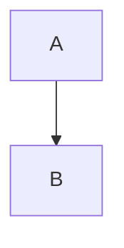
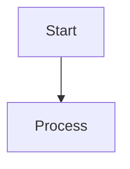
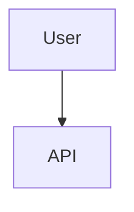
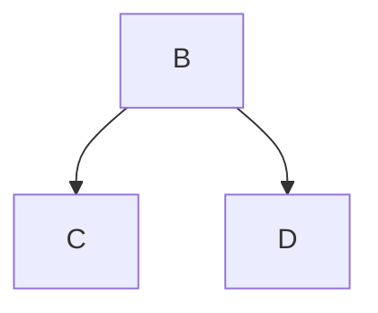

# Mermaid to Visio Conversion Guide

Complete guide for converting Mermaid diagrams to Visio-compatible formats.

---

## Overview

The `mermaid_to_visio.py` tool extracts Mermaid diagrams from markdown files and converts them to formats that Visio can import (SVG, PNG, PDF).

**Why SVG for Visio?**
- Vector format (scales without quality loss)
- Editable in Visio
- Maintains diagram structure
- Professional quality

---

## Prerequisites

### 1. Install Node.js

Download from: https://nodejs.org/

```powershell
# Verify installation
node --version
npm --version
```

### 2. Install Mermaid CLI

```bash
npm install -g @mermaid-js/mermaid-cli
```

### 3. Verify Installation

```bash
python mermaid_to_visio.py --check
```

---

## Quick Start

### Convert Single File

```bash
# Convert to SVG (default)
python mermaid_to_visio.py docs/architecture.md

# Convert to multiple formats
python mermaid_to_visio.py docs/architecture.md --formats svg png pdf
```

### Convert All Files in Directory

```bash
# Process all markdown files in docs/
python mermaid_to_visio.py docs/

# Include subdirectories
python mermaid_to_visio.py docs/ --recursive
```

### Custom Output Directory

```bash
python mermaid_to_visio.py README.md --output exports/
```

---

## Usage Examples

### Example 1: Architecture Documentation

```bash
# Convert architecture diagrams to SVG for Visio
python mermaid_to_visio.py docs/architecture.md --formats svg

# Output: diagrams/architecture_diagram_1_graph.svg
#         diagrams/architecture_diagram_2_sequenceDiagram.svg
```

### Example 2: All Documentation

```bash
# Convert all diagrams in docs/ and subdirectories
python mermaid_to_visio.py docs/ --recursive --formats svg png

# Creates both SVG (for Visio) and PNG (for presentations)
```

### Example 3: README Diagrams

```bash
# Convert README diagrams to PDF for printing
python mermaid_to_visio.py README.md --formats svg pdf
```

---

## Importing to Visio

### Method 1: Insert SVG (Recommended)

1. Open Visio
2. **Insert** → **Pictures** → **From File**
3. Navigate to `diagrams/` folder
4. Select `.svg` file
5. Click **Insert**

**Result:** Vector graphic that can be edited, resized, and styled in Visio

### Method 2: Drag and Drop

1. Open Visio
2. Open File Explorer to `diagrams/` folder
3. Drag `.svg` file onto Visio canvas

### Method 3: Copy-Paste

1. Open `.svg` in browser or image viewer
2. Copy image
3. Paste into Visio

---

## Output Files

For each Mermaid diagram, the tool creates:

| File | Purpose | Visio Compatible |
|------|---------|------------------|
| `.mmd` | Mermaid source | No (reference only) |
| `.svg` | Vector graphic | ✅ Yes (best) |
| `.png` | Raster image | ✅ Yes (not editable) |
| `.pdf` | Document | ✅ Yes (via import) |

---

## File Naming Convention

Files are named: `{source}_{diagram}_{number}_{type}.{ext}`

**Examples:**
- `architecture_diagram_1_graph.svg`
- `scheduling_diagram_2_sequenceDiagram.png`
- `README_diagram_1_flowchart.pdf`

**Components:**
- `architecture` - Source markdown filename
- `diagram` - Always "diagram"
- `1` - Diagram number in file
- `graph` - Mermaid diagram type
- `.svg` - Output format

---

## Supported Diagram Types

All Mermaid diagram types are supported:

- **Flowchart** - `graph TD`, `graph LR`
- **Sequence Diagram** - `sequenceDiagram`
- **Class Diagram** - `classDiagram`
- **State Diagram** - `stateDiagram-v2`
- **Entity Relationship** - `erDiagram`
- **User Journey** - `journey`
- **Gantt Chart** - `gantt`
- **Pie Chart** - `pie`
- **Git Graph** - `gitGraph`
- **C4 Diagrams** - `C4Context`, `C4Container`

---

## Command Line Reference

```bash
python mermaid_to_visio.py [input] [options]
```

### Arguments

| Argument | Description | Default |
|----------|-------------|---------|
| `input` | Markdown file or directory | Required |
| `--formats` | Output formats (svg, png, pdf) | `svg` |
| `--output` | Output directory | `diagrams/` |
| `--recursive` | Process subdirectories | `False` |
| `--check` | Check if Mermaid CLI installed | - |

### Examples

```bash
# Check installation
python mermaid_to_visio.py --check

# Single file, SVG only
python mermaid_to_visio.py docs/architecture.md

# Multiple formats
python mermaid_to_visio.py docs/architecture.md --formats svg png pdf

# All files in directory
python mermaid_to_visio.py docs/

# Recursive with custom output
python mermaid_to_visio.py docs/ --recursive --output exports/diagrams/
```

---

## Troubleshooting

### Error: "Mermaid CLI not found"

**Solution:**
```bash
npm install -g @mermaid-js/mermaid-cli
python mermaid_to_visio.py --check
```

### Error: "No Mermaid diagrams found"

**Causes:**
- Markdown file has no Mermaid code blocks
- Code blocks not properly formatted

**Check:**
```markdown
# Correct format


# Incorrect (missing language)
```
graph TD
    A --> B
```
```

### Error: "Conversion failed"

**Solutions:**
1. Check Mermaid syntax is valid
2. Test at https://mermaid.live
3. Update Mermaid CLI: `npm update -g @mermaid-js/mermaid-cli`

### SVG Not Editable in Visio

**Cause:** Some complex Mermaid diagrams export as single image

**Solutions:**
1. Use simpler diagram structure
2. Import as PNG instead
3. Manually recreate in Visio using SVG as reference

---

## Workflow Integration

### Automated Conversion

Create a script to convert after documentation updates:

```powershell
# convert_diagrams.ps1
python mermaid_to_visio.py docs/ --recursive --formats svg png
Write-Host "Diagrams updated in diagrams/ folder"
```

### Git Pre-Commit Hook

Automatically convert diagrams before commit:

```bash
# .git/hooks/pre-commit
#!/bin/bash
python mermaid_to_visio.py docs/ --recursive --formats svg
git add diagrams/
```

### VS Code Task

Add to `.vscode/tasks.json`:

```json
{
  "label": "Convert Mermaid to Visio",
  "type": "shell",
  "command": "python mermaid_to_visio.py docs/ --recursive",
  "group": "build"
}
```

---

## Advanced Usage

### Custom Mermaid Configuration

Create `mermaid-config.json`:

```json
{
  "theme": "default",
  "themeVariables": {
    "primaryColor": "#0066cc",
    "primaryTextColor": "#fff",
    "primaryBorderColor": "#004499"
  }
}
```

Use with Mermaid CLI:
```bash
mmdc -i diagram.mmd -o diagram.svg -c mermaid-config.json
```

### Batch Processing Script

```python
from pathlib import Path
from mermaid_to_visio import MermaidConverter

converter = MermaidConverter(output_dir=Path("exports"))

# Process multiple files
files = [
    Path("docs/architecture.md"),
    Path("docs/scheduling.md"),
    Path("README.md")
]

for file in files:
    converter.process_markdown_file(file, formats=['svg', 'png'])
```

---

## Comparison: Mermaid vs Visio

| Feature | Mermaid | Visio |
|---------|---------|-------|
| **Format** | Text-based | Binary/XML |
| **Version Control** | ✅ Excellent | ❌ Poor |
| **Collaboration** | ✅ Easy (text diff) | ⚠️ Requires Visio |
| **Automation** | ✅ Scriptable | ⚠️ Limited |
| **Styling** | ⚠️ Limited | ✅ Extensive |
| **Corporate Standard** | ⚠️ Varies | ✅ Common |
| **Learning Curve** | ✅ Low | ⚠️ Medium |
| **Cost** | ✅ Free | ❌ License required |

**Recommendation:** Use Mermaid for documentation, export to Visio for presentations.

---

## Best Practices

### 1. Keep Mermaid Source

Always keep `.mmd` files for future edits:
```bash
# Include .mmd in output
python mermaid_to_visio.py docs/ --formats svg
# Creates both .mmd and .svg
```

### 2. Use Descriptive Filenames

```markdown
<!-- Good: Descriptive comment above diagram -->


<!-- Bad: No context -->

```

### 3. Test Before Converting

Validate at https://mermaid.live before converting

### 4. Version Control SVGs

Add to `.gitignore` if regenerating frequently:
```
diagrams/*.svg
diagrams/*.png
```

Or commit if they're final deliverables.

### 5. Document Diagram Purpose

Add comments in markdown:
```markdown
## System Architecture

The following diagram shows the high-level system architecture:



This architecture supports...
```

---

## FAQ

### Q: Can I edit the SVG after importing to Visio?

**A:** Yes! SVG imports as vector graphics. You can:
- Resize without quality loss
- Change colors
- Modify shapes
- Add text

### Q: What if my diagram is too complex?

**A:** Break it into multiple smaller diagrams:
```markdown
## Architecture Overview


## Detailed Component View

```

### Q: Can I automate this in CI/CD?

**A:** Yes! Example GitHub Actions:
```yaml
- name: Convert Mermaid to SVG
  run: |
    npm install -g @mermaid-js/mermaid-cli
    python mermaid_to_visio.py docs/ --recursive
    
- name: Upload artifacts
  uses: actions/upload-artifact@v2
  with:
    name: diagrams
    path: diagrams/
```

### Q: Does this work on Mac/Linux?

**A:** Yes! The tool is cross-platform. Just install Node.js and Mermaid CLI.

---

## Resources

- **Mermaid Documentation:** https://mermaid.js.org/
- **Mermaid Live Editor:** https://mermaid.live
- **Mermaid CLI:** https://github.com/mermaid-js/mermaid-cli
- **Visio Import Guide:** https://support.microsoft.com/en-us/office/insert-pictures-in-visio

---

## Support

For issues with:
- **This tool:** Check logs, verify Mermaid CLI installation
- **Mermaid syntax:** Test at https://mermaid.live
- **Visio import:** Check SVG is valid, try PNG as fallback
- **Conversion quality:** Adjust Mermaid diagram complexity

---

## License

This tool is part of the MCP Daily Planning System.
MIT License - See LICENSE file for details.
