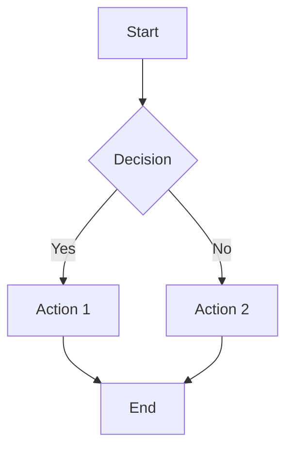
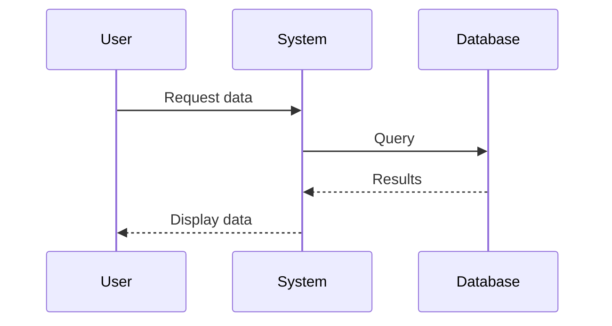
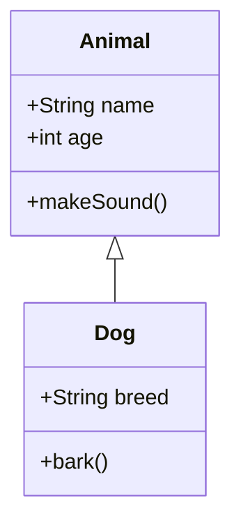

# Test Mermaid Diagrams

This file contains sample Mermaid diagrams for testing the converter.

## Simple Flowchart

```mermaid
graph TD
    A[Start] --> B{Decision}
    B -->|Yes| C[Action 1]
    B -->|No| D[Action 2]
    C --> E[End]
    D --> E
```

## Sequence Diagram

```mermaid
sequenceDiagram
    participant User
    participant System
    participant Database
    
    User->>System: Request data
    System->>Database: Query
    Database-->>System: Results
    System-->>User: Display data
```

## Class Diagram

```mermaid
classDiagram
    class Animal {
        +String name
        +int age
        +makeSound()
    }
    class Dog {
        +String breed
        +bark()
    }
    Animal <|-- Dog
```
